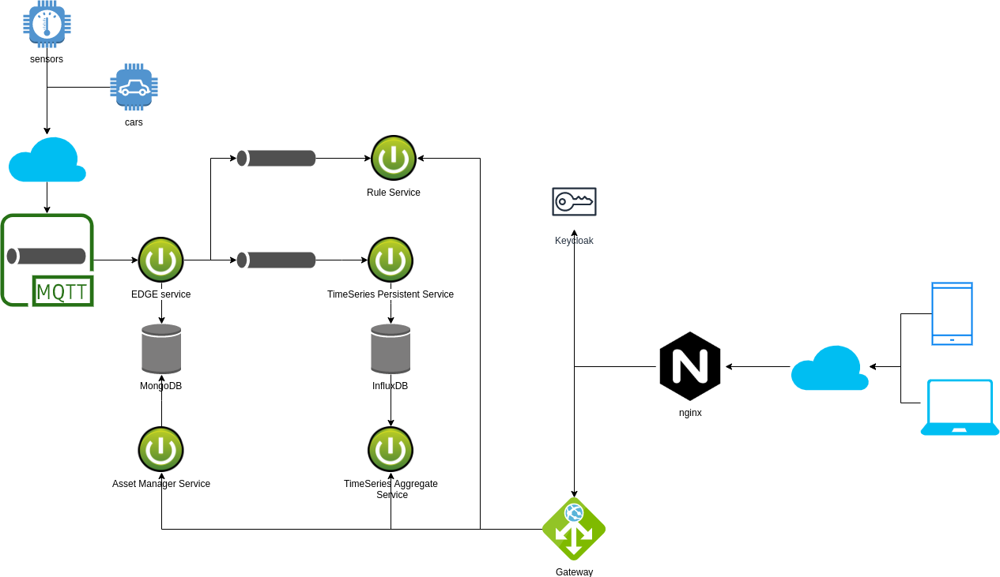

# Architecture to a IoT Ingestion / Report System

With the advent of 5G technology, many devices will be connected to the Internet and could be monitored, in an attempt to reach this objective is important the definition of a robust IoT architecture.

One robust architecture to IoT must explore some concepts and contain specific components, to turn the architecture extansible, high availible and scalible, because in this case, we must expected 
a mass incoming of informations, the generation of customizable reports, the flexible of the data information and too many others aspects.

Trying to reach this qualities the following archicture is proposed bellow:

## Big Picture



The architecture basically have two main areas:

## 1 - Ingestion

The ingestion is responsible to consume the data sent from assets(sensor, cars, iot devices in general). He use the mqtt protocol to receive data and is divided in three services:

### Edge / Ingestion service

The main responsability of this service is consume the data send to **mqtt broker** and verify whether the information is valid to send it to the **Time series persistent service**. The service use a **mqtt broker**, the incoming message will be sent in JSON, with the following example of payload:

```json
{
    "id": "2", 
    "tenantId": "1", 
    "token": "321", 
    "timestamp": 123213123, 
    ... custom fields
    "temperature": 27.3, 
    "memory": 36.3
}
```

The mandatory fields are:
 - id: is the identifier of the asset
 - tenantId: is the identifier of the owner of asset
 - token: is the secret key, which one validate or invalidate the message
 - timestamp: the moment when the data is collected
 - custom fields: this fields represent the data about asset, in case of this could be: speed, acceleration, voltage of battery, instant consumption, etc

### Time series persistent service

This service is reponsible about the persistance of information of incoming data from **Edge / Ingestion service**, this data will be persited in one database, the choosen database for architecture was **InfluxDB**.

InfluxDB is an open-source time series database (TSDB). It is written in Go and optimized for fast, high-availability storage and retrieval of time series data in fields such as operations monitoring, application metrics, Internet of Things sensor data, and real-time analytics.

#### The main Influxdb concepts are:

1. **Measurement**: A measurement is loosely equivalent to the concept of a table in relational databases. Measurement is inside which a data is stored and a database can have multiple measurements. A measurement primarily consists of 3 types of columns Time, Tags and Fields
2. **Time**: A time is nothing but a column tracking timestamp to perform time series operations in a better way. The default is the Influxdb time which is in nanoseconds, however, it can be replaced with event time.
3. **Tags**: A tag is similar to an indexed column in a relational database. An important point to remember is that relational operations like WHERE, GROUP BY etc, can be performed on a column only if it is marked as a Tag
4. **Fields**: Fields are the columns on which mathematical operations such as sum, mean, non-negative derivative etc can be performed. However, in recent versions string values can also be stored as a field.
5. **Series**: A series is the most important concept of Influxdb. A series is a combination of tags, measurement, and retention policy (default of Influxdb). An Influxdb database performance is highly dependent on the number of unique series it contains, which in turn is the cardinality of tags x no. of measurement x retention policy

### Asset Service

This service is responsible for maintain the Assets of system(Sensors, cars, iot devices), each asset is composed of the token, id and tenant to sent data to **Edge Service**. All the assets will be persisted in a document database, in this architecture the choosen database was MongoDB

## 2 - Reporting

Reporting will be the component responsible to show / generate information and send notification about the assets. The component have two main service:

### Time series aggregation service

This service is responsible for query the data of the assets, the service can return data in the following formats:
 - **raw data**: the representation of raw data sent from the iot devices
 - **aggregated data**: Aggregates data creates aggregated summaries of numeric time series data and provides interfaces to read them. This allows applications to retrieve smaller data sets that cover a long time range with much better performance than processing all the raw time series data.

The following filters will be provided by API:

 - **from**: start date to query the timeseries, format MUST be Zulu Time or using the keyword **now()**
 - **to**: end date to query the timeseries, format MUST be Zulu Time or using the keyword **now()** 
 - **selectCriteria**: criteria select to query, aggregation functions can be used(mean, man, min, etc)
 - **intervalValue**: group by interval value, for aggregation results
 - **intervalUnit**: group by interval unit, for aggregation results
 

### Rule Service

The main responsibility of this service is notify the owner of the asset when a rule was triggered. The notification can be sent with a e-mail/SMS/mobile application notification. Above some examples of rules:

 - a car reached the 10000 kilometers and a new revision must be done
 - the temperature of a sensor reached a specific value

A rule automatically triggers events when she detects the overshooting or undershooting of a defined threshold value. You can define the exact threshold value in the rule configuration. 


## Considerations

This architecture is only one case of how to approach the problem, many aspects could be change or override, but the concepts of one IoT system architecture, problaly will be based on this type of approach where the system will have two front: one ingestion and one report.

# Requirements to System

You will need to have pre installed:
 - JDK 8
 - maven
 - docker
 - docker-compose
 
# Developer start up

Clone the **iot-infra** and the execute the shell script **clone**:

```sh
$ chmod +x clone && ./clone
```

This command will create a folder in your home with all repos to development:

```sh
$ cd ~/iot-dev
```

Now you can start you favorite IDE and edit the code

# Runing the development environment

```sh
$ cd ~/iot-dev/iot-infra && docker-compose -f docker-compose-dev.yml up -d --build
```
 
 
